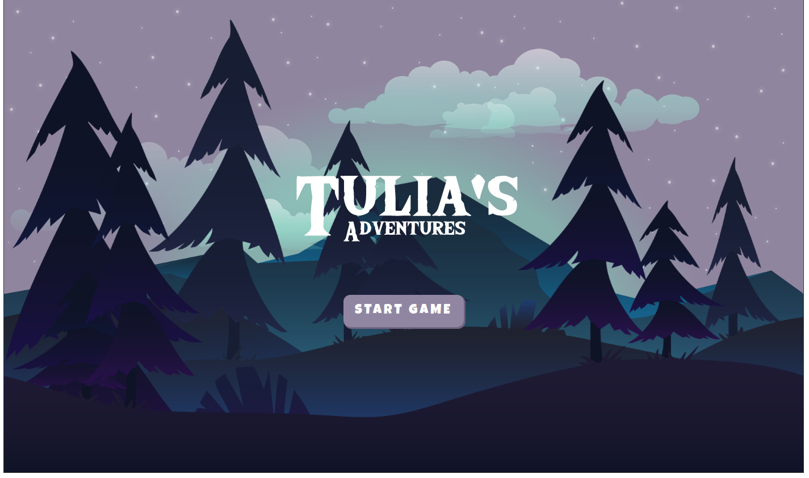

## Tulia's Adventures

The protagonist Tulia is my female persona, which found herself in a dark forest at night and has to escape from some elemental golems that are lurking in the woods.   

## About the game

This is a simple game made with Javascript and the [p5.js](https://p5js.org/) drawing library. It was coded alongside a crash course called [Javascript Game Dev](https://www.alura.com.br/imersao-gamedev-javascript). However, only the wider idea was followed so the code is completely made by myself. 

## Screenshots and how to play

You shall dodge the enemies using the keyboard arrow up key. You have a limited number of lives and a score that keeps incrementing itself. The goal is simply to get the highest score possible.   

Initial screen: 

Playing the game and seeing the game over screen:

## Files and Assets

The library files are imported via CDN in the index.hmtl file. The sketch.js is a template for the p5.js sketch, with added logic to make the game work as expected. Check [this link](https://github.com/processing/p5.js/wiki/Local-server) to run the game locally. 

All the assets are free and found at:
* [Game backgrounds](https://free-game-assets.itch.io/free-horizontal-game-backgrounds)
* [Character sprites](https://craftpix.net/freebies/free-2d-fantasy-elf-warrior-character-sprites/)
* [Enemy sprites](https://craftpix.net/freebies/free-golem-tiny-style-2d-character-sprites/)
* [Soundtrack](https://www.fesliyanstudios.com/royalty-free-music/download/the-unsolved-mystery/225)
